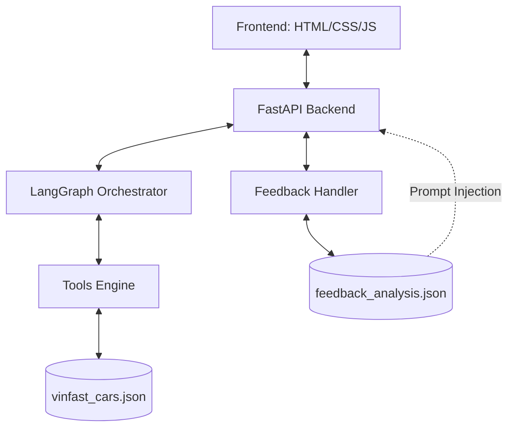

# Project Architecture: VinFast AI Consultant

This document provides a technical overview of the VinFast AI Agent architecture, a high-precision, JSON-backed consultative AI designed for the electric vehicle market.

## High-Level Overview

The system is built on a **Precision-First** architecture, prioritizing accurate vehicle data over the broad but often hallucinatory nature of RAG (Retrieval-Augmented Generation).

---

## 1. Core Components

### A. Frontend (static/index.html)
- **Design**: Premium Glassmorphism UI using Vanilla CSS.
- **Features**: Responsive chat interface, interactive feedback (Like/Dislike), session metrics tracking, and markdown rendering (marked.js).
- **Communication**: REST API calls to `/api/chat`, `/api/stats`, and `/api/feedback`.

### B. Orchestration (server.py)
- **Framework**: FastAPI (Asynchronous).
- **AI Logic**: LangGraph state machine.
- **Memory**: `MemorySaver` provides per-session persistent conversation history.
- **Dynamic Context**: Injecting recent lessons from `feedback_analysis.json` into the system prompt at runtime.

### C. Brain & Capabilities (tools.py + system_promt.txt)
- **System Prompt**: Defines the "VinFast Consultant" persona, enforces **Sequential Probing** (Budget -> Seats -> Use Case), and strictly prevents off-topic discussions.
- **Tools**: Python functions that perform fuzzy-matching and data extraction from the vehicle database.
- **Precision Data**: Operates on a structured `vinfast_cars.json` representing all VinFast models (VF 3 to VF 9), pricing, and color palettes.

### D. Self-Refinement System (feedback_handler.py)
- **Trigger**: Activated by a "Dislike" action on the UI.
- **Process**: 
    1. Retrieves failing conversation context.
    2. Performs **Root Cause Analysis (RCA)** using a separate LLM (GPT-4o-mini).
    3. Generates a structured "Lesson Learned".
    4. Persists the lesson to `feedback_analysis.json`.

---

## 2. Data Flow: The "Consultation Loop"

1. **Input**: User asks "I want to buy a car".
2. **Sequential Probing**: Agent identifies missing info (Budget) and asks a single question.
3. **Information Gathering**: User provides budget. Agent asks for seat capacity.
4. **Action**: Once all 3 mandatory inputs (Budget, Seats, Purpose) are collected, the Agent summarizes and executes `recommend_cars`.
5. **Output**: Agent presents a markdown table of suggested vehicles with "Price with Battery" and technical highlights.

---

## 3. Deployment & Environment

- **Runtime**: Python 3.9+
- **Environment**: Managed via `.env` (OPENAI_API_KEY).
- **Servers**:
    - **Development**: FastAPI reloader mode.
    - **Port**: 8080 (Localhost).
- **Dependencies**: LangChain, LangGraph, FastAPI, Uvicorn, Pydantic.

---

## 4. Key Security & Guardrails

- **Zero Hallucination**: Tool-enforced data retrieval.
- **Stay on Topic**: Explicit constraints against non-VinFast queries.
- **Sequential Guardrail**: Code and prompt logic prevents listing multiple requirements in one turn.
- **Escalation**: System automatically triggers `escalate_to_human()` if a complex error occurs or if the user is dissatisfied.
