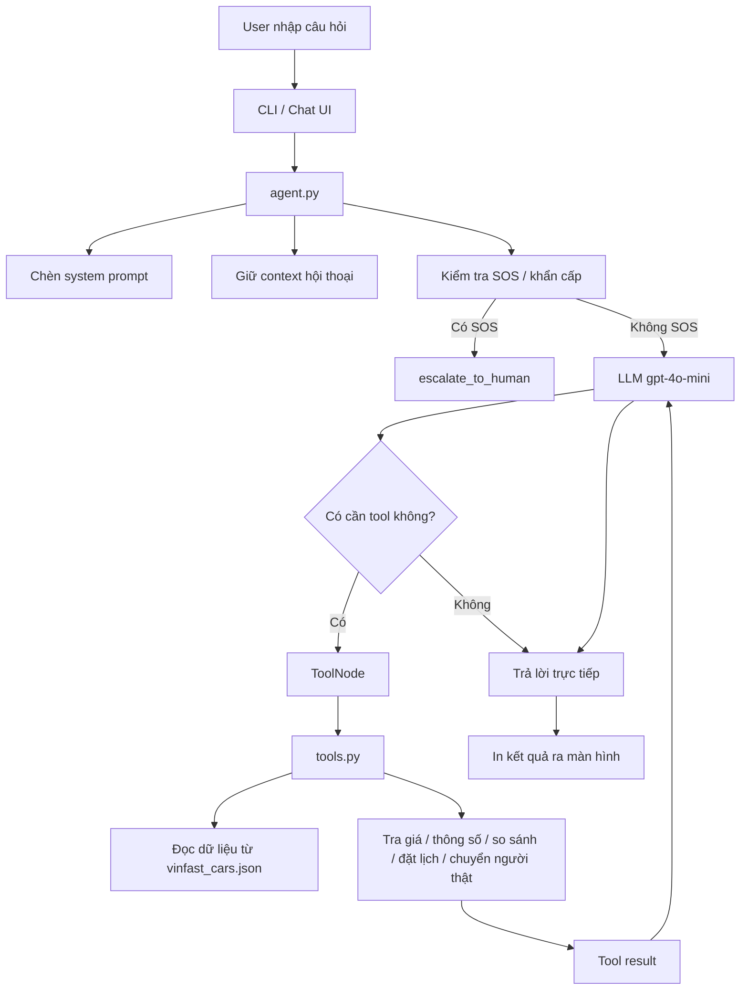

# Luồng Hệ Thống - AI Agent CSKH VinFast

Tài liệu này tóm tắt luồng hoạt động của hệ thống để dễ trình bày khi demo.

## 1) Tổng quan

Hệ thống hoạt động theo mô hình:

- User nhập nhu cầu
- `agent.py` nhận tin nhắn và điều phối
- LLM quyết định có cần gọi tool hay không
- `tools.py` trả dữ liệu từ JSON / nghiệp vụ
- Agent tổng hợp kết quả và trả lời
- Nếu gặp tình huống khẩn cấp hoặc ngoài phạm vi, hệ thống chuyển sang người thật

## 2) Sơ đồ luồng hệ thống



## 3) Luồng chi tiết theo code

### Bước 1: User nhập câu hỏi

Ví dụ:

```text
Tôi muốn mua xe điện, ngân sách khoảng 700 triệu, chủ yếu đi trong thành phố
```

## Bước 2: `agent.py` nhận input

File `agent.py`:

- nạp `system_promt.txt`
- giữ state hội thoại bằng `AgentState`
- khởi tạo `ChatOpenAI(model="gpt-4o-mini")`
- bind các tool từ `tools.py`

## Bước 3: Kiểm tra ngữ cảnh và SOS

Trước khi gọi LLM, agent:

- chỉ giữ tối đa 10 lượt human gần nhất
- chèn lại system prompt vào đầu context
- kiểm tra từ khóa khẩn cấp như:
  - tai nạn
  - xe hỏng giữa đường
  - không phanh
  - cháy xe

Nếu có SOS:

- agent ưu tiên gọi `escalate_to_human`
- không cố trả lời kỹ thuật sâu

## Bước 4: LLM quyết định có gọi tool không

LLM có thể:

- trả lời trực tiếp nếu câu hỏi đơn giản
- gọi tool nếu cần tra dữ liệu cụ thể

Các tool chính trong `tools.py`:

- `get_car_specs`
- `get_pricing_and_battery_policy`
- `recommend_cars`
- `compare_vinfast_cars`
- `get_battery_lease_policy`
- `get_maintenance_schedule`
- `book_service`
- `escalate_to_human`
- `get_charging_policy`

## Bước 5: Tool trả dữ liệu có kiểm soát

`tools.py` không để LLM tự bịa thông số.

Thay vào đó:

- đọc từ `vinfast_cars.json`
- áp dụng logic lọc / so sánh / đề xuất
- thêm disclaimer cho giá và chính sách
- trả về text sạch để LLM diễn giải lại

## Bước 6: Agent tổng hợp và trả kết quả

Sau khi có tool result:

- LangGraph đưa kết quả về lại node `agent`
- LLM đọc kết quả tool
- trả lời tự nhiên cho user

## 4) Luồng demo dễ nói

Bạn có thể trình bày ngắn như sau:

> User nói nhu cầu -> `agent.py` nhận -> kiểm tra khẩn cấp -> nếu bình thường thì LLM chọn tool -> `tools.py` tra dữ liệu thật từ JSON -> LLM diễn giải lại -> trả kết quả cho user.

## 5) Điểm mạnh của kiến trúc này

- Có ngữ cảnh hội thoại nhờ `MemorySaver`
- Có thể gọi tool đúng lúc
- Hạn chế hallucination bằng dữ liệu có cấu trúc
- Có nhánh an toàn khi user gặp tình huống khẩn cấp
- Dễ demo vì luồng rõ ràng và có log tool call

## 6) Câu chốt khi thuyết trình

> “Hệ thống này không chỉ chat trả lời chung chung. Nó điều phối hội thoại bằng LangGraph, dùng tool để lấy dữ liệu thật từ `tools.py`, và có nhánh chuyển người thật khi gặp tình huống khẩn cấp.”

